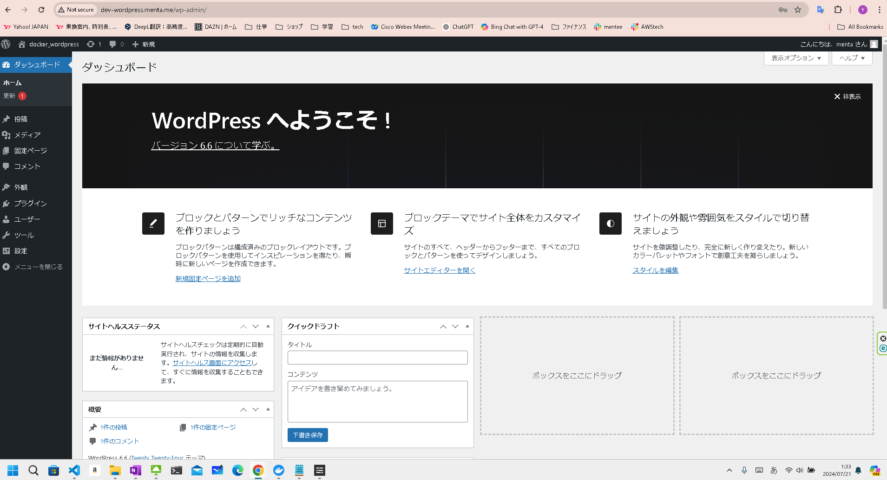

# build wordpress by docker

# 構成
クライアント→wordpressコンテナ→mysqlコンテナ

image:wordpress:php8.1-apache

image:mysql:8

コンテナ内NWは検証のためdriver: bridgeを使用

build 管理はdocker-compose.ymlを利用

# 実行コマンド
docker build --no-cache
docker-compose up -d

# 自ドメインでアクセス
http://dev-wordpress.me

